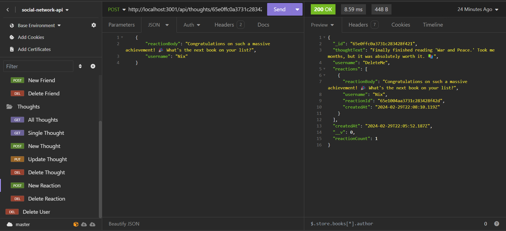

# social-network-api

## Description
Challenge 18 -- NoSQL: Social Network API

This project was built in order to build an API for a social network web application where users can share their thoughts, react to friends’ thoughts, and create a friend list. I used Express.js for routing, a MongoDB database, and the Mongoose ODM, and provided my own seed data entered into Insomnia before the walkthrough video was recorded.

Since this project is back end, there will not be a live site to visit, however, you are free to test the back end and server by utilizing the program Insomnia, or MongoDB Compass, so that you can interact with the database. If you would just like to view this being done, please visit the [Usage](#usage) section to view a video walkthrough.

## Table of Contents

- [Installation](#installation)
- [Usage](#usage)
- [License](#license)
- [Badges](#badges)
- [Features](#features)
- [Tests](#tests)
- [Questions](#questions)

## Installation

In order to run the program, please use `npm i` in order to install the required dependiencies listed in the package.json being "express", "mongoose", & "MongoDB"(indluded in moongoose).

## Usage

Begin the program by typing into your terminal `node server.js`/`npm run start`. (Please make sure to have previously installed the programs dependencies mentioned in the [Installation](#installation) section).

Walkthrough video showing functionality of program:
* Link to walkthrough video: *(click the Insomnia image)*

## License

[MIT License](https://opensource.org/licenses/MIT)

## Badges

## Features

For application-specific features, please revisit the [Description](#description) & [Usage](#usage) sections

* JavaScript
* JSON
* Express 
* Node
* MongoDB
* Mongoose
* Nodemon
* Insomnia
* MongoDB Compass

## Tests

- You can test this back end project by using the program Insomnia so that you can interact with the database. 

- You can also test this project by using MongoDB Compass to see and interact with the database.

- If you would just like to view the program, please visit the [Usage](#usage) section to view a video walkthrough of the program being tested.

## Questions

If you have any questions, feel free to reach out to me via [GitHub](https://github.com/jskelly8/) or email me at jessskelton888@gmail.com.